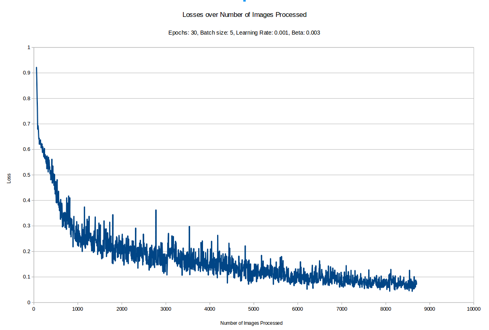

# CarND-Semantic-Segmentation-Solution
Solution to Term 3, Project 2 of Udacity Nanodegree: Semantic Segmentation

To run the project:
```
    python main.py EPOCHS BATCH_SIZE LEARNING_RATE BETA
``` 

The best results for both images and video were obtained with the following:
```
    python main.py 30 5 0.001 0.003
```  




See video here:
[](https://youtu.be/85jKOR98PYA)

